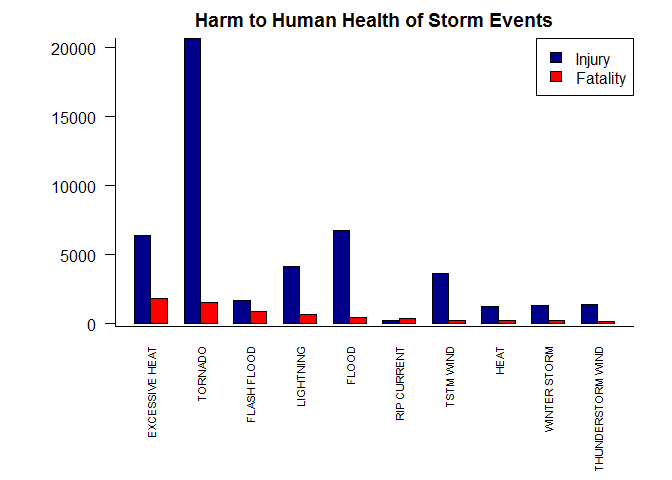
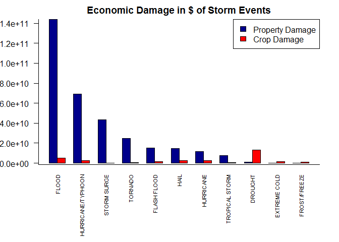

Synopsis
--------

This study assesses the impact of storms in the United States and
attempts to identify which types of weather events are the most costly.
Cost is assessed in terms of the human cost, namely injuries and
fatalities, and the economic costs, namely property and crop damage. The
data for this study comes from the National Climactic Data Center's
Storm Events database which is based on reports provided by the Natinoal
Weather Service. All events in the database from the year 1996 are
considered, as 1996 was the first year all types of storms are recorded
in the database. The study demonstrates that while excessive heat is the
cause of the most fatalities in the United States, tornados are a close
second and are responsible for 3.1 times more injuries than any other
storm event type. Economic damage caused by storm events is caused
primarily by floods which cause two times more property damage than the
next highest event type, hurricanes and typhoons. Droughts were
responsible for the bulk of the crop damage seen in the united states,
causing 2.7 times more than floods which were the second largest
contributor to crop damage. Further study is required into the regional
effects of storm events as geographical region is very likely to have an
impact on the type of events that are likely to cause damage. This study
was carried out as peer assessment 2 for the Coursera Data Science -
Reproducible Research course, administered by Johns Hopkins Bloomberg
School of Public Health.

Data Source
-----------

The raw data covers a date range from 1950 through November, 2011. For
reference, it is located at
[<https://d396qusza40orc.cloudfront.net/repdata%2Fdata%2FStormData.csv.bz2>](https://d396qusza40orc.cloudfront.net/repdata%2Fdata%2FStormData.csv.bz2).
The storm events database is built from reports recieved from the
National Weather Service and includeds 37 measurements per storm event,
including the start date, storm event type and damage caused by the
storm in terms of fatalities, injuries, property damage and crop damage.

Not all storm event types were recorded over the time frame covered in
the database. According to the [online
documentation](http://www.ncdc.noaa.gov/stormevents/details.jsp?type=eventtype),
all event types covered in the database were not considered until 1996.

Additional information about the dataset can be obtained from the [Storm
Data
Documentation](https://d396qusza40orc.cloudfront.net/repdata%2Fpeer2_doc%2Fpd01016005curr.pdf)
and from the [National Climatic Data Center Storm Events
FAQ](https://d396qusza40orc.cloudfront.net/repdata%2Fpeer2_doc%2FNCDC%20Storm%20Events-FAQ%20Page.pdf)

Data Processing
---------------

To start out, get and read the database. If it is not currently present
download it and then read it into memory. The download date is stored in
a file in the same directory for reference.

    source_data_file <- "https://d396qusza40orc.cloudfront.net/repdata%2Fdata%2FStormData.csv.bz2"
    work_data_file <- "assignment.csv.bz2"
    if (!file.exists(work_data_file)) {
      if( Sys.info()['sysname'] == "Windows" ) {
        download.file(source_data_file, destfile=work_data_file, mode="wb")
      } else {
        download.file(source_data_file, destfile=work_data_file, method = "curl")
      }
      write(date(), file="dateDownloaded.txt")
    }

The raw data covers events back to 1950 but not all event types were
reported until 1996. As we are interested primarily in which types of
events cause the most damage, data before 1996 will be removed. In
addition, not all measurements in the database are needed for this study
so a cleaned dataset is generated to improve processing efficiency
containing only the event type and columns related to the damage caused
by storm events.

    raw_data <- read.csv(bzfile(work_data_file), stringsAsFactors = F, strip.white = T)

    # before 1996 not all events were recorded, therefore eliminate them to remove bias
    raw_data$BGN_DATE <- strptime(raw_data$BGN_DATE, format = "%m/%d/%Y %T")
    clean_data <- raw_data[
      raw_data$BGN_DATE > strptime("12/31/1995 23:59:59", format = "%m/%d/%Y %T"),
      c("EVTYPE", "FATALITIES", "INJURIES", "PROPDMG", "PROPDMGEXP", "CROPDMG",  "CROPDMGEXP")
    ]

    # Trim the event type filed and convert it into a factor variable along with the crop and
    # property damage tens multiplier columns
    suppressWarnings(library(stringr))
    clean_data$EVTYPE <- as.factor(str_trim(clean_data$EVTYPE))
    clean_data$PROPDMGEXP <- as.factor(clean_data$PROPDMGEXP)
    clean_data$CROPDMGEXP <- as.factor(clean_data$CROPDMGEXP)

    # Clear the raw data from memory as it is no longer needed
    rm(raw_data)

Economic damage is stored in two columns per damage type. A decimal
value and a multiplier of thousands, millions or billions. Convert the
decimal value columns into dollar values so that they can be easily
compared and agrigated

    clean_data[clean_data$PROPDMGEXP == "K","PROPDMG"] <- clean_data[clean_data$PROPDMGEXP == "K","PROPDMG"] * 1e3
    clean_data[clean_data$PROPDMGEXP == "M","PROPDMG"] <- clean_data[clean_data$PROPDMGEXP == "M","PROPDMG"] * 1e6
    clean_data[clean_data$PROPDMGEXP == "B","PROPDMG"] <- clean_data[clean_data$PROPDMGEXP == "B","PROPDMG"] * 1e9
    clean_data[clean_data$CROPDMGEXP == "K","CROPDMG"] <- clean_data[clean_data$CROPDMGEXP == "K","CROPDMG"] * 1e3
    clean_data[clean_data$CROPDMGEXP == "M","CROPDMG"] <- clean_data[clean_data$CROPDMGEXP == "M","CROPDMG"] * 1e6
    clean_data[clean_data$CROPDMGEXP == "B","CROPDMG"] <- clean_data[clean_data$CROPDMGEXP == "B","CROPDMG"] * 1e9

Now that the data set is cleaned for this study, it can be aggregated
for study. Get the sums of injuries, fatalities, crop damage and
property damage separated event type.

    fatalities_sum <- aggregate(clean_data$FATALITIES,list(EventType = clean_data$EVTYPE) ,sum)
    injuries_sum <- aggregate(clean_data$INJURIES,list(EventType = clean_data$EVTYPE) ,sum)
    propdmg_sum <- aggregate(clean_data$PROPDMG,list(EventType = clean_data$EVTYPE) ,sum)
    cropdmg_sum <- aggregate(clean_data$CROPDMG,list(EventType = clean_data$EVTYPE) ,sum)

To assess the largest contributors, sort each collection of sums by
their values

    fso <- fatalities_sum[order(fatalities_sum$x,decreasing = TRUE),]
    iso <- injuries_sum[order(injuries_sum$x,decreasing = TRUE),]
    pso <- propdmg_sum[order(propdmg_sum$x,decreasing = TRUE),]
    cso <- cropdmg_sum[order(cropdmg_sum$x,decreasing = TRUE),]

For efficient review, only high damage event types are of interest. In
the case of human costs, the top 8 causes of injuries and fatalities are
taken and injury and fatality data is retrieved for every event type in
the two top 8 sums. The number 8 was used because the combined number of
events was close to 10 which seemed to be a limit for easy display. Once
the sets are combined, sort and label the columns.

    top_human = 8
    top_is = head(iso, n = top_human)
    top_fs = head(fso, n = top_human)
    combined_human_sums = rbind(top_fs,top_is)
    is_tops = injuries_sum[injuries_sum$EventType %in% combined_human_sums$EventType, ]
    fs_tops = fatalities_sum[fatalities_sum$EventType %in% combined_human_sums$EventType, ]

    human_sums <- cbind(is_tops$x,fs_tops$x)
    rownames(human_sums) <- is_tops$EventType
    colnames(human_sums) <- c("Injury","Fatality")
    # Sort it to get the biggest first
    human_sums <- human_sums[order(human_sums[,2], decreasing = T),]

A similary grouping of sums was undertaken for economic cost. In this
case the top 8 damage sums of property and crop damage was assembled for
review.

    top_economic = 8
    top_ps = head(pso, n = top_economic)
    top_cs = head(cso, n = top_economic)
    combined_economic_sums = rbind(top_cs,top_ps)
    ps_tops = propdmg_sum[propdmg_sum$EventType %in% combined_economic_sums$EventType, ]
    cs_tops = cropdmg_sum[cropdmg_sum$EventType %in% combined_economic_sums$EventType, ]

    economic_sums <- cbind(ps_tops$x,cs_tops$x)
    rownames(economic_sums) <- ps_tops$EventType
    colnames(economic_sums) <- c("Property Damage","Crop Damage")
    # Sort it to get the biggest first
    economic_sums <- economic_sums[order(economic_sums[,1], decreasing = T),]

Results
-------

### Human Health Costs of Storm Events

The cost to human health is measured in total fatalities and injuries
caused by each event type. The aggregated sums of these values in the
United States spanning January 1996 through November 2011 are shown
below.

    plot_colors <- c("darkblue","red")
    op <- par(no.readonly = TRUE)
    par( mar=c(8,6,2,2))
    barplot(
        t(human_sums),
        beside=T,
        las=2,
        col=plot_colors,
        cex.names=0.7,
        main="Harm to Human Health of Storm Events"
    )
    legend("topright",colnames(human_sums), fill=plot_colors)
    box(bty="l")

Based on this analysis, tornados generate 3.1 times more injuries than
floods (20667 vs 6758) and caused the second highest number of
fatalities (1511), the highest number of fatalities was caused by
excessive heat (1797).

### Economic Damage due to Storm Events

The economic damage due to storm events in terms of crop and property
damage in dollars is displayed below for the United States spanning a
time period spanning January 1996 through November 2011.

    plot_colors <- c("darkblue","red")
    op <- par(no.readonly = TRUE)
    par(mar=c(8,4,2,2))
    barplot(
        t(economic_sums),
        beside=T,
        las=2,
        col=plot_colors,
        cex.names=0.7,
        main="Economic Damage in $ of Storm Events"
    )
    legend("topright",colnames(economic_sums), fill=plot_colors)
    box(bty="l")

Based on the this analysis, the magnitude of property damage far exceeds
the damage done to crops by storm events. Floods are the largest
contributor to property damage, generating \$143,944,833,550 in damage.
The second largest source of damage was property damage due to
hurricanes and typhoons which totaled to \$69,305,840,000. The largest
source of crop damage was droughts at \$13,367,566,000 in damage which
was 2.7 times the damage caused by floods, which was \$4,974,778,400.

To be a good citizen, it is always good to put things back the way you
found them. In this case we will restore the plotting settings for r.

    suppressWarnings(par(op))

### Summary

In general, a lot of the years spanned by the storm events database were
not of use in this study as they did not consider all event types. When
years not considering all event types were considered, tornados,
excessive heat and floods had the largest impacts on human health.
Economic costs were primarily generated in the form of property damage
with the major portion of the damage caused by flooding. The largest
cause of crop damage was drought and then flooding. Based on this very
high level analysis, state bodies should probably attempt to mitigate
potential damages caused by floods, protect crops from droughts and
protect humans from tornados, floods and excessive heat as first
priorities.

It should be noted that storm event occurrences are likely dependant on
local geography. The next logical step for future studies should be to
examine the regional costs generated by storm events. It may also be
useful to examine the change over time in damage caused by storm events
because it is likely that some steps have already been taken to mitigate
damage based on paste events.
